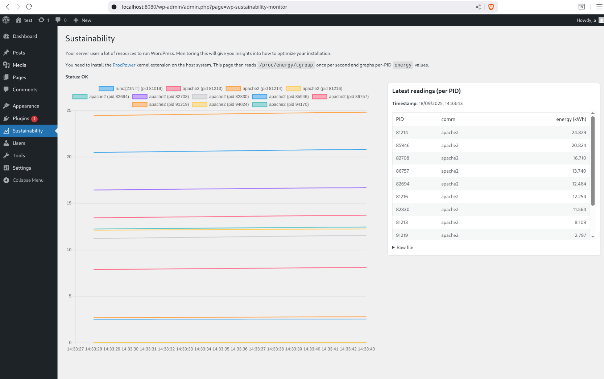

# WP Sustainability Monitor


A WordPress admin plugin that visualizes the energy consumption of your WordPress installation in real time.
It reads data from the [`procpower`](https://github.com/green-kernel/procpower) kernel extension (`/proc/energy/cgroup`) and displays it in a live chart (1-second interval) directly in the WordPress dashboard.

<p align="center">
  
</p>

---

## ✨ Features

- Adds a **Sustainability** menu entry in the WordPress admin area
- Reads energy usage per PID from `/proc/energy/cgroup` (via `procpower`)
- Displays a real-time line chart using [Chart.js](https://www.chartjs.org/)
- Shows tabular readings sorted by current energy use
- Includes raw `/proc/energy/cgroup` output for debugging
- Keeps data fully inside the Docker container — **no sensitive host data is leaked**

---

## ⚡ Requirements

- Linux host with [`procpower`](https://github.com/green-kernel/procpower) installed and `/proc/energy/cgroup` available
- Docker & Docker Compose
- WordPress (containerized in this setup)

---

## 🚀 Quick Start (Docker Compose)

Clone this repository and run WordPress with the plugin:

```bash
git clone https://github.com/your-org/wp-sustainability-monitor.git
cd wp-sustainability-monitor

docker compose up

Then you can access the demo under http://localhost:8080/